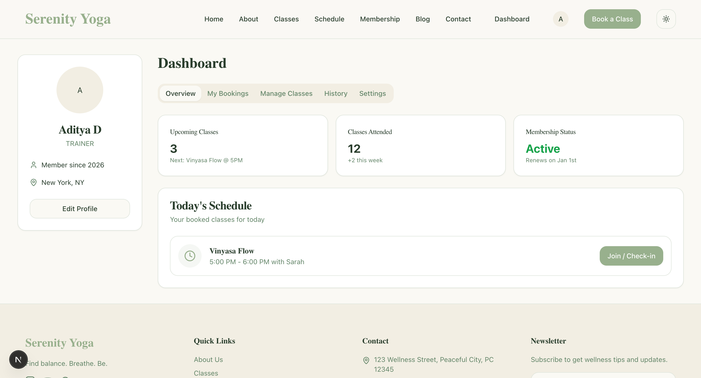
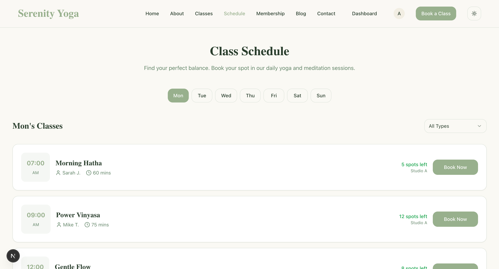
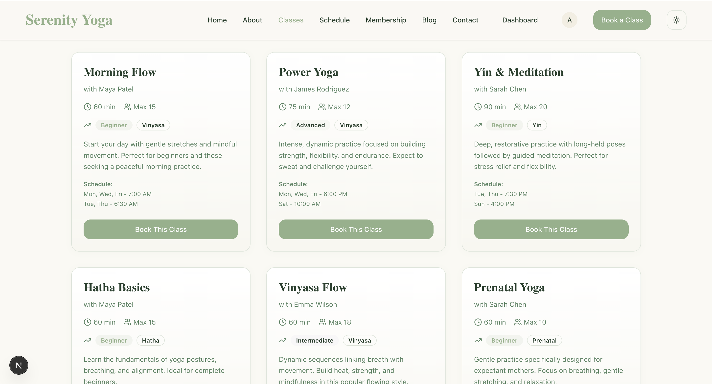

# 🧘‍♀️ Mindful Haven
Mindful Haven is a holistic wellness application designed to connect users with expert trainers for yoga, meditation, and mindfulness practices. This platform facilitates seamless class management, booking, and user engagement, fostering a community dedicated to well-being. <br>

Visit the Live Site now - [Mindful Haven](https://mindfulhaven-9w3gnqsrw-gokuls-projects-963b05d4.vercel.app/) <br>

## Table of Contents
- [Screenshots](#screenshots)
- [Features](#features)
- [Tech Stack and Tools](#tech-stack-and-tools)
- [Getting Started](#getting-started)
    - [Prerequisites](#prerequisites)
    - [Installation](#installation)
    - [Usage Guide](#usage-guide)
    - [Project Structure](#project-structure)

## Screenshots
* Homepage  <br><br>
* Dashboard  <br><br>
* Trainer Profile  <br>
* Class Schedule  <br>
* Class Management  <br>

## Features
### 🧘 For Users
*   **Explore Classes**: Browse a variety of yoga and meditation classes by difficulty, style, and schedule.
*   **User Dashboard**: Track upcoming bookings, past attendance, and membership status.
*   **Secure Authentication**: Easy sign-up and login process.
### 🧘‍♀️ For Trainers
*   **Trainer Dashboard**: A dedicated space to manage your professional schedule.
*   **Class Management**: Create, update, and delete your own classes.
*   **Profile Management**: Showcase your specialties and bio (coming soon).
### 🛠 Technical Highlights
*   **Role-Based Access Control**: Secure routing and API protection distinguishing between `USER` and `TRAINER` roles.
*   **Razorpay Payment Integration**: Full working payment gateway that accepts diverse payments (Cards, UPI, Wallets, Netbanking, EMI).
*   **Dynamic Data**: Real-time updates for class listings and availability.
*   **Modern UI/UX**: Built with shadcn/ui and Tailwind CSS for a premium, accessible, and responsive design.
## Tech Stack and Tools
**Framework**: [Next.js 15](https://nextjs.org/) (App Router) <br>
**Language**: [TypeScript](https://www.typescriptlang.org/) <br>
**Styling**: [Tailwind CSS](https://tailwindcss.com/) <br>
**UI Components**: [shadcn/ui](https://ui.shadcn.com/) (Radix UI) <br>
**Database**: [MongoDB](https://www.mongodb.com/) <br>
**ORM**: [Prisma](https://www.prisma.io/) <br>
**Authentication**: Custom JWT-based auth <br>
**Form Validation**: [Zod](https://zod.dev/) <br>
**Icons**: [Lucide React](https://lucide.dev/) <br>
**IDE**: [Google Antigravity](https://antigravity.google/) <br>
**API Testing**: [Postman](https://www.postman.com/) <br>

## Getting Started
### Prerequisites
*   Node.js (v18 or higher)
*   npm or yarn
*   MongoDB instance
### Installation
1.  **Clone the repository**
    ```bash
    git clone <repository-url>
    cd mindfulhaven-app
    ```
2.  **Install dependencies**
    ```bash
    npm install
    # or
    yarn install
    ```
3.  **Environment Setup**
    Create a `.env` file in the root directory and add your environment variables:
    ```env
    DATABASE_URL="mongodb+srv://..."
    JWT_SECRET="your-super-secret-key"
    ```
4.  **Database Setup**
    Push the Prisma schema to your database:
    ```bash
    npx prisma db push
    ```
5.  **Run the development server**
    ```bash
    npm run dev
    ```
    Open [http://localhost:3000](http://localhost:3000) with your browser to see the result.
## Usage Guide
### Signing Up as a Trainer
1.  Navigate to the **Sign Up** page.
2.  Fill in your details.
3.  Check the box **"Sign up as an Instructor/Trainer"**.
4.  Once registered, you will be redirected to the dashboard where you can access the "Manage Classes" tab.
### Creating a Class (Trainers Only)
1.  Go to your **Dashboard**.
2.  Click on the **"Manage Classes"** tab.
3.  Click **"Create Class"**.
4.  Fill in the class details (Title, Schedule, Price, Capacity) and save.
## Project Structure
*   `src/app`: App Router pages and API routes.
*   `src/components`: Reusable UI components.
*   `src/lib`: Utilities (Prisma client, Auth helpers, etc.).
*   `src/context`: React Context providers (AuthContext).
*   `prisma`: Database schema.
